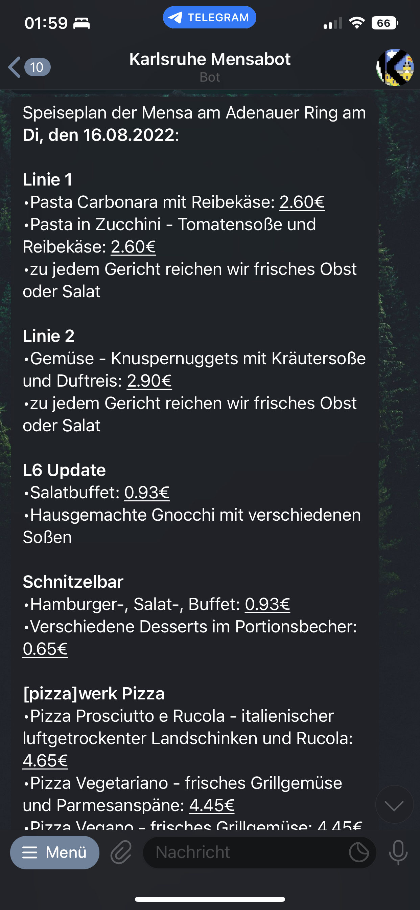

# KIT-Mensabot

A telegram bot for accessing the menus of the canteens in Karlsruhe.

## Features

- Access menus of all canteens in Karlsruhe.
- Select a centeen and get daily automatic menu updates.
- Get random content from [r/KaIT](https://www.reddit.com/r/KaIT/)

## Demo


A running demo of the telegram bot can be found [here](https://t.me/ka_mensabot).

### Screenshots

<table>
  <tr>
    <td>Start Command</td>
     <td>Menu Command</td>
     <td>Memes Command</td>
  </tr>
  <tr>
    <td></td>
    <td></td>
    <td></td>

  </tr>
 </table>

## Setup

To run this app, add a `data` folder inside the projects root directory, containing the config file (`config.json`):

```json
{
  "telegram_token": "<YOUR_TELEGRAM_BOT_TOKEN>",
  "api_user_name": "<API_USER_NAME>",
  "api_password": "<API_PASSWORD>",
  "data_refresh_time": "00:00",
  "push_notification_time": "09:30"
}
```

## Docker

The docker container can be started by using the following command, where `~/Documents/telegram/mensa_bot/data` is the
local path to your data folder.

```bash
docker run -v ~/Documents/telegram/mensa_bot/data:/usr/src/app/data therealjohannes/kit-mensabot
```
